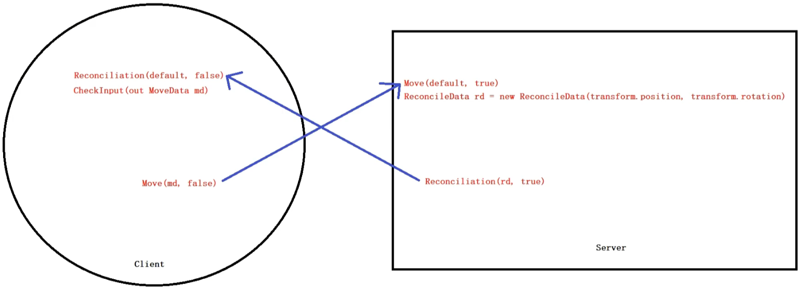

# FishNetStudy

| FishNetStudy_1     |
| ------------------ |
| FishNet安装        |
| 生成Player         |
| 客户端权威         |
| Player移动         |
| 指定Player生成位置 |
| 相机Camera         |
| 生成子弹           |
| 子弹运动           |
| 子弹超时和碰撞销毁 |

| FishNetStudy_2               |
| ---------------------------- |
| 导入有动画的模型             |
| 行走Walk动画同步             |
| 物理和非物理方式实现跳跃Jump |
| 机器人Robot的跳跃            |
| 跳跃动画的同步               |
| 转身动画的实现               |
| 发射子弹的时间间隔           |
| SyncVar实现不同颜色的Player  |
| 游戏运行时改变Player的颜色   |
| 用RPC实现不同颜色的Player    |
| Player顶部血条               |
| 血条数值和死亡动画同步       |

| FishNetStudy_3/Fishnet Client-Side Prediction |
| --------------------------------------------- |
| 基本场景                                      |
| 客户端权威                                    |
| 服务器权威                                    |
| 弱网工具                                      |

| FishNetStudy_4/Fishnet Client-Side Prediction |
| --------------------------------------------- |
| 官方例子TransformPrediction                   |
| 工作流是怎样的                                |
| 数据结构                                      |
| 传递数据的两个方法                            |
| 获取数据的两个方法                            |
| 改用Rigidbody                                 |
| 官方Rigidbody例子                             |
| 完成Rigidbody方式的客户端预测脚本             |
| 测试Rigidbody的客户端预测                     |

# NetworkTransform

```c#
private void TimeManager_OnTick()
{
    if(base.IsOwner)
    {
        Reconciliation(default, false);//调整数据。按照服务器端返回的数据调整
        CheckInput(out MoveData md);//当前客户端输入数据
        Move(md, false);//客户端按照输入移动并将输入传递给服务器端
    }
    if (base.IsServer)
    {
        Move(default, true);//移动服务器端对象
        ReconcileData rd = new ReconcileData(transform.position, transform.rotation);//获得服务器端对象移动后的对象
        Reconciliation(rd, true);//将服务器端对象移动后的数据传递给客户端
    }
}
```



# Rigidbody

```c#
private void TimeManager_OnTick()
{
    if (base.IsOwner)
    {
        Reconciliation(default, false);//调整数据。按照服务器端返回的数据调整
        CheckInput(out MoveData md);//当前客户端输入数据
        Move(md, false);//客户端按照输入移动并将输入传递给服务器端
    }
    if (base.IsServer)
    {
        Move(default, true);//移动服务器端对象
    }
}
private void TimeManager_OnPostTick()
{
    if (base.IsServer)
    {
        ReconcileData rd = new ReconcileData(transform.position, transform.rotation, _rigidbody.velocity, _rigidbody.angularVelocity);//获得服务器端对象移动后的对象
        Reconciliation(rd, true);//将服务器端对象移动后的数据传递给客户端
    }
}
```


